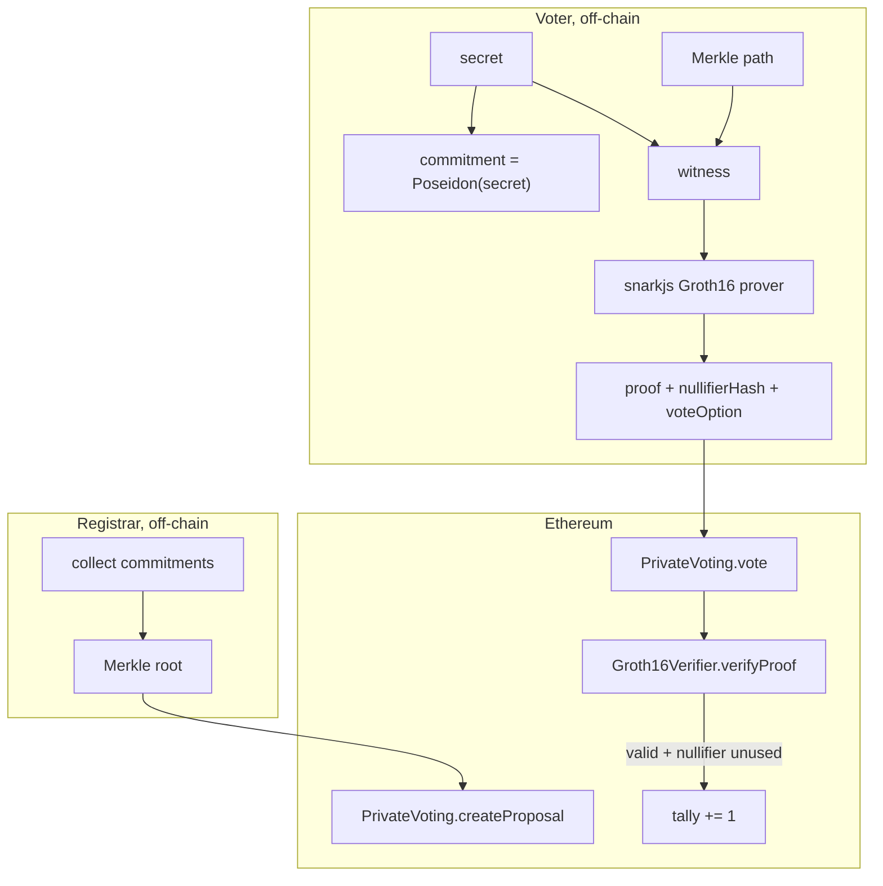

# Veil — Design and Threat Model

Anonymous private voting on Ethereum using a Groth16 zkSNARK.

## 1. Problem

On a public ledger every transaction is attributable by address. For governance
this is fatal: if a DAO votes on-chain, anyone can see exactly who voted and how.
That enables coercion, vote-buying, retaliation, and bandwagon effects. Veil lets
an organization run a vote where:

- only pre-registered members can vote (**eligibility**),
- nobody can vote more than once per proposal (**uniqueness**),
- no observer can link a ballot to the member who cast it (**anonymity**),
- and the final tally is publicly verifiable (**auditability**).

## 2. Privacy primitive and why

| Candidate | Fit for anonymous voting | Verdict |
|-----------|--------------------------|---------|
| ZK        | Prove eligibility + uniqueness while revealing nothing about identity; verification is cheap on-chain. | **Chosen** |
| FHE       | Could also hide the vote *value*, but ~1000x slower and heavier tooling than needed for an MVP. | Overkill |
| MPC       | Needs ≥2 non-colluding operators online; adds liveness assumptions. | Heavier trust |
| TEE       | Fast, but trusts the hardware vendor and is exposed to side channels. | Weaker model |

Anonymous voting is fundamentally a *membership + uniqueness* statement, which is
exactly what a succinct ZK proof expresses with the smallest trust footprint. The
proof is verified by a stateless on-chain contract; no extra parties are trusted
for privacy.

## 3. Cryptographic construction

- **Curve / proof system:** Groth16 over BN254 (alt_bn128). Chosen for constant
  3-point proofs and a precompile-backed pairing check, making on-chain
  verification cheap.
- **Hash:** Poseidon, a ZK-friendly hash that is far cheaper inside an arithmetic
  circuit than Keccak. Used for both the identity commitment and the Merkle tree.
- **Identity:** a voter draws a random field element `secret`. Their public
  commitment is `Poseidon(secret)`. The registrar collects commitments and
  publishes a Merkle root; the secret never leaves the voter.
- **Eligibility:** the circuit recomputes the commitment from `secret` and proves
  it is a leaf of the tree whose root the contract stored for the proposal.
- **Uniqueness:** the voter reveals `nullifierHash = Poseidon(secret, proposalId)`.
  It is deterministic per (voter, proposal), so a second ballot collides and is
  rejected, yet it leaks nothing about identity and is unlinkable across proposals.
- **Ballot integrity:** `voteOption` is a public input constrained to be boolean,
  so the proof is bound to the exact choice. A relayer cannot flip a vote without
  invalidating the proof.

### Public vs private signals

| Signal | Visibility | Role |
|--------|-----------|------|
| `root` | public | which electorate the ballot is drawn from |
| `nullifierHash` | public | double-vote prevention |
| `proposalId` | public | binds the ballot to one proposal |
| `voteOption` | public | the YES/NO choice |
| `secret` | private | the voter's identity |
| `pathElements`, `pathIndices` | private | Merkle authentication path |

## 4. Architecture

### Data flow for one ballot

1. The registrar collects member commitments, builds the Poseidon Merkle tree,
   and calls `createProposal(proposalId, root, description)`.
2. A voter builds a witness from their `secret` and Merkle path and generates a
   Groth16 proof locally.
3. The voter sends `vote(proposalId, nullifierHash, voteOption, a, b, c)`.
4. The contract checks the nullifier is unused, calls the verifier with
   `[root, nullifierHash, proposalId, voteOption]`, and on success records the
   nullifier and increments the tally.

## 5. Threat model

**Who sees what.** Every input to `vote` is public calldata. Observers learn the
proposal, the nullifier, the chosen option, and that *some* eligible member voted.
They do **not** learn which member, and cannot link two ballots by the same member
across different proposals.

**Who we trust.**

- *For privacy:* no one. Anonymity rests only on the zero-knowledge property of
  Groth16 and the preimage resistance of Poseidon.
- *For soundness:* the Groth16 trusted setup. If the setup toxic waste leaked, an
  attacker could forge proofs. We mitigate with a local multi-contribution
  ceremony (`scripts/build-circuit.sh`); a production deployment would run a
  multi-party ceremony with independent contributors.
- *For eligibility:* the registrar, who decides which commitments enter the tree.

**Attacks considered.**

| Attack | Defense |
|--------|---------|
| Vote twice | Deterministic nullifier per (voter, proposal); contract stores used nullifiers. |
| Vote without membership | Merkle inclusion is a circuit constraint; a non-member cannot produce a satisfying witness. |
| Flip someone's vote in flight | `voteOption` is a bound public input; changing it fails verification. |
| Forge a proof | Soundness of Groth16 under a clean trusted setup. |
| Deanonymize via the nullifier | Nullifier is `Poseidon(secret, proposalId)`; inverting it breaks Poseidon preimage resistance. |
| Replay another proposal's ballot | `proposalId` is mixed into both the nullifier and the verified public inputs. |

## 6. Known limitations (MVP scope)

- The **vote value is public** per ballot (only the voter's identity is hidden).
  Hiding the value as well would require homomorphic tallying (FHE) or a
  commit-reveal layer; it is out of scope for this MVP.
- **Network-level metadata** (IP, timing) can correlate a ballot with a submitter.
  A production system would relay ballots or use a meta-transaction layer.
- The **registrar is trusted** to define the electorate honestly.
- The **trusted setup** here is single-machine; production needs a real ceremony.
